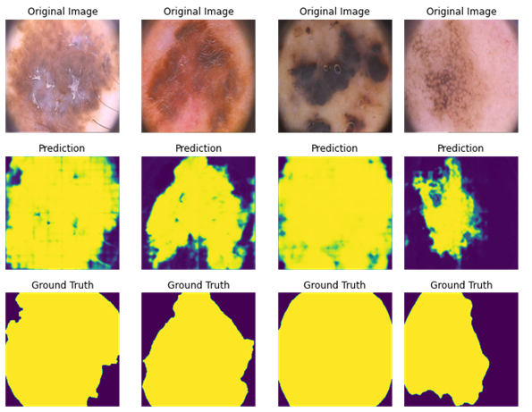

# Segmentation of melanoma dataset

In the current project in was developed segmentation of melanoma 

It was tested several models with different loss functions. The names are represented below in the tables

| Models                  | Number |     | Losses                         | Number |
|-------------------------|--------|-----|--------------------------------|--------|
| SegNet                  | 0      |     | BCELoss                        | 0      |
| UNet                    | 1      |     | bce_loss                       | 1      |
| UNet_stride             | 2      |     | dice_loss                      | 2      |
| UNet_dilate             | 3      |     | focal_loss                     | 3      |
 |                         |        |     | tversky_loss_alpha_0.00        | 4      |
 |                         |        |     | tversky_loss_alpha_0.10 | 5   |
 |                         |        |     | tversky_loss_alpha_0.20 | 6   |
 |                         |        |     | tversky_loss_alpha_0.30 | 7   |
|                         |        |     | tversky_loss_alpha_0.40 | 8   |
 | | |     | tversky_loss_alpha_0.50 | 9      |
 | | |                                | tversky_loss_alpha_0.60 | 10     |
       | | |                          | tversky_loss_alpha_0.70 | 11     |
             | | |                    | tversky_loss_alpha_0.80 | 12     |
                   | | |              | tversky_loss_alpha_0.90 | 13     |
                         | | |        | tversky_loss_alpha_1.00 | 14     |

## Models

### Segnet

SegNet is a deep convolutional neural network architecture used for semantic segmentation of images. 
It consists of an encoder network that produces a feature map and a decoder network that performs upsampling to 
produce a pixel-wise segmentation map.


* Badrinarayanan, V., Kendall, A., & Cipolla, R. (2015). [SegNet: A deep convolutional
encoder-decoder architecture for image segmentation](https://arxiv.org/pdf/1511.00561.pdf)

### UNet 
U-Net is another deep convolutional neural network architecture used for semantic segmentation of images. 
It consists of an encoder network that reduces the spatial resolution of the input image, followed by a decoder
network that increases the spatial resolution of the feature map to produce a pixel-wise segmentation map. 
U-Net is widely used in medical image analysis due to its ability to produce accurate segmentations with limited 
training data.


[**Original paper about UNet**](https://arxiv.org/abs/1505.04597)

### UNet_stride
It was used results from the [**paper**](https://arxiv.org/abs/1412.6806) which reports about using stride in Convolutions
instead of pooling, and in Transpose Convolutions instead of UpSampling

### UNet_dilate
Almost the same approach as with stride: using Convolution instead of pooling and Transpose Convolution instead of UpSampling,
but using dilution, instead of stride

* Yu, Fisher, and Vladlen Koltun. "[Multi-scale context aggregation by dilated convolutions.](https://arxiv.org/pdf/1511.07122.pdf)" arXiv preprint arXiv:1511.07122 (2015).

## Losses

### BCELoss 

That's the loss function from the PyTorch library

Some another function were implemented manually:

### bce_loss

It is the same mathematically function, but more stable 

$$\mathcal L_{BCE} = \hat y - y\hat y + \log\left(1+\exp(-\hat y)\right).$$

### dice_loss

The usual metric for evaluation of image segmentation performance is intersection over union(IoU) or dice coefficient

$$D(X,Y)=\frac{2|X\cap Y|}{|X|+|Y|}$$

And for loss function it was used modification suitable for differentiation 

$$\mathcal L_D(X,Y) = 1-\frac{1}{256 \times 256} \times \sum_i\frac{2X_iY_i}{X_i+Y_i}.$$

### focal_loss

Another function that could be used for image segmentation is focal loss

[**paper:**](https://arxiv.org/pdf/1708.02002.pdf)

$$\mathcal L_{focal}(y, \hat y) = -\sum_i \left[\left(1-\sigma(\hat y_i)\right)^\gamma y_i\log\sigma(\hat y_i) + (1-y_i)\log(1-\sigma(\hat y_i))\right].$$

### tversky_loss

Another option is to use tversky loss function:

$$\mathcal T(\alpha, \beta) = \frac{\sum_{i=1}^{N} p_{0i}g_{0i}}{\sum_{i=1}^{N} p_{0i}g_{0i} + \alpha \sum_{i=1}^{N} p_{0i}g_{1i} + \beta \sum_{i=1}^{N} p_{1i}g_{0i}}.$$

[**paper:**](https://arxiv.org/pdf/1706.05721.pdf)

The Tversky loss is a generalization of the Dice loss and F1-score, specifically designed for the task of image segmentation

α and β are typically set between 0 and 1, and their sum (α + β) is equal to 1.

If α > β, the Tversky loss will penalize false positives more than false negatives, making it more suitable for cases with higher false positive rates.

If α < β, the Tversky loss will penalize false negatives more than false positives, making it more suitable for cases with higher false negative rates.

## Installation

To set up the required environment and install the necessary dependencies, please use the provided environment.yml file. Run the following command in your terminal:

```bash
conda env create -f environment.yml
```
After the installation is complete, activate the environment using:

```bash
conda activate <env_name>
```

Replace <env_name> with the name specified in the environment.yml file.

## Usage

The assembling.py script is used for training the SegNet or UNet segmentation networks. To run the script, use the following command along with the desired options:

```bash
python assembling.py --model MODEL --loss LOSS --batch_size BATCH_SIZE --epochs EPOCHS --new_dataframe NEW_DATAFRAME --save_model SAVE_MODEL --evaluate EVALUATE
```
Options
--model MODEL: The model number from the table (SegNet or UNet).
--loss LOSS: The loss function from the table (e.g., Tversky loss).
--batch_size BATCH_SIZE: The size of the batch during training.
--epochs EPOCHS: The number of epochs to train the model.
--new_dataframe NEW_DATAFRAME: If set to a non-zero value, a new dataframe with the training results will be created.
--save_model SAVE_MODEL: If set to a non-zero value, the best model during training will be saved.
--evaluate EVALUATE: If set to a non-zero value, the model will be evaluated on the test dataset at the end of training. This option requires save_model to be set to 1.

### Automated Training and Reporting

This repository also includes a bash script for running the training script with multiple combinations of models and loss functions, followed by generating a report with performance graphs.

The run_experiments.sh script automates the training process for all possible combinations of models and loss functions. By default, it will train with 20 epochs and a batch size of 25. You can customize these values by providing command line arguments when running the script.

To execute the script, run the following command in your terminal:

```bash
./run_experiments.sh [EPOCHS] [BATCH_SIZE]
```
Replace [EPOCHS] and [BATCH_SIZE] with the desired number of epochs and batch size, respectively. If you don't provide these values, the script will use the default values of 20 epochs and a batch size of 25.

The script will remove any existing results.csv file in the /results folder and create a new one with the updated results.

In the end it will create pictures for report

### Generating Performance Graphs
Pictures could be created manually by running:

```bash
python plotting_results.py
```
This will create performance graphs for combination of models and loss functions, that has been accumilated in resutls.csv. It possible to make new csv by setting new_dataframe to 1

## Results

The training and validation losses for 20 epochs can be viewed in this [table](pics/results.csv). 
Additionally, a visual representation is available in the automatically generated [image](pics/results.png). 
Please note that the image is large; a cropped version is also provided.


The Intersection over Union (IoU) metric for each case is displayed below:


As observed, the best performance is achieved using UNet_dilate and Tversky loss with alpha values of 0.00 or 0.10.

As previously noted, when the alpha value is close to zero, the Tversky loss penalizes false negatives more heavily than false positives. This makes it better suited for situations with higher false negative rates.

From our dataset analysis, it is evident that there is a significant number of false negatives in the training data.




As observed, the model attempts to refine the boundaries, whereas the ground truth is relatively rough. This may explain why the Tversky loss with a small alpha parameter yields the highest metrics.

During the model selection process, each model-loss pair was trained for 20 epochs with a batch size of 25. The results for the top two performers are as follows:

UNet_dilate + tversky_loss_alpha_0.00 - IoU: 0.8249
UNet_dilate + tversky_loss_alpha_0.10 - IoU: 0.8247

The performance of the first model is shown below, while the second one can be found at this [link](pics/UNet_dilate_tversky_loss_alpha_0.10_0.png)


Following this, the combination of UNet_dilate + tversky_loss_alpha_0.10 was trained for 50 epochs with a batch size of 50. This helped to slightly improve the final score, reaching 0.8329. The final results are displayed below:


For this optimal configuration, the IoU on the test dataset, which performed best during validation, is 0.8612.


